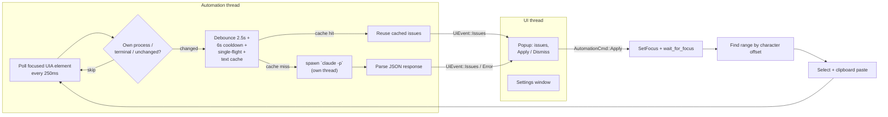

# Alfred Writer

A grammar and style checker for Windows — a native, system-wide app (no browser required) that works in any text field on your desktop, powered by Claude via your existing [Claude Code](https://claude.com/claude-code) login.

## How it works

- A background thread uses Windows UI Automation to watch whatever text field currently has keyboard focus, in any app.
- After a 2.5s pause in typing (and the field has enough text), it runs `claude -p` as a subprocess with the current text and a JSON schema for the response — reusing your existing Claude Code session, no separate API key needed.
  - Checks are throttled: at most one per field every 6s, and only one `claude` process runs at a time — a burst of typing doesn't spawn a burst of subprocesses.
  - Exact text that's already been checked (retyped, undone, or refocused) is served from an in-memory cache instead of spawning `claude` again.
- A small floating popup appears near the text caret showing each issue with **Apply** / **Dismiss** buttons.
- Applying a suggestion refocuses the field, selects the exact matching text (built from character offsets via UI Automation, so multi-word phrases are as reliable as single-word fixes) and pastes the replacement over it via the clipboard, so it works in plain edit boxes as well as most rich text controls.

## Architecture

Alfred Writer is two threads talking over channels: an **automation thread** (owns Windows
UI Automation, on its own COM apartment) and the **UI thread** (egui/eframe, otherwise
invisible — it only ever shows the popup or the settings window). Neither thread reaches
into the other's state.



Module layout:


Key design points:
- **No typed corrections.** Fixes are applied via clipboard + Ctrl+V, never synthetic per-character keystrokes, to avoid dropped/garbled input.
- **Offset-based text matching**, not `TextPattern::FindText` alone — more reliable for multi-word phrases across different UIA providers.
- **Cost/latency guards** (debounce, cooldown, single-flight, cache) exist together on purpose since every check spawns a real subprocess.
- **Per-app policy** (`targets::classify`) is the extension point for future app-specific behavior (e.g. skipping terminals today).

## Requirements

- Windows.
- [Claude Code](https://claude.com/claude-code) installed and logged in, with `claude` on your `PATH`. Alfred Writer shells out to it for every check instead of calling the Anthropic API directly.

## Build & run

Requires the Rust toolchain (`rustup`) on Windows.

```
cargo build --release
target\release\alfred-writer.exe
```

The app runs from the system tray (no window on launch). Click the tray icon for:
- **Enabled** — toggle checking on/off globally.
- **Settings…** — pick a model.
- **Quit**.

Settings are stored locally at `%APPDATA%\AlfredWriter\config.json`.

## Settings

- **Model** — Opus 4.8 (most capable), Sonnet 5, or Haiku 4.5 (default — recommended since each check spawns a fresh `claude -p` process, and checks fire on every pause in typing; faster/cheaper models keep that snappy).
- **Enabled** — global on/off toggle.

## Known limitations (MVP)

- Windows only (relies on the Windows UI Automation API).
- Each check spawns a `claude -p` process, which is slower (several seconds) than a direct API call — expect latency.
- Terminals (`cmd.exe`, PowerShell, Windows Terminal, ConEmu, mintty, ...) are intentionally skipped — most of their visible text is immutable scrollback, not editable prose.
- Electron/Chromium apps (VS Code, Slack, etc.) generally work but aren't individually validated.
- Google Docs is not reliably supported unless you enable Docs' own **Tools → Accessibility → Turn on screen reader support** (Docs otherwise renders text as canvas, invisible to UI Automation).
- No custom tray icon art yet — a plain colored dot is used for now.
