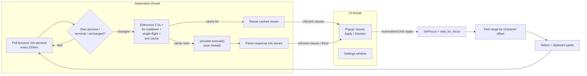
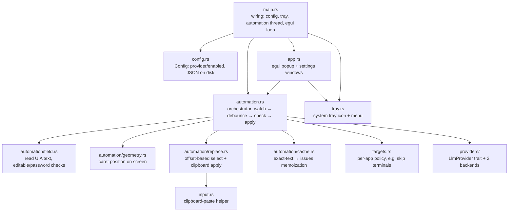

# Alfred Writer (AW)

A grammar and style checker for Windows — a native, system-wide app (no browser required) that works in any text field on your desktop, powered by a local model or a command you control. No commercial cloud API is called directly by this app.

"AW" for short — it's what the tray tooltip, window titles, and the badge icon in every window use as shorthand for Alfred Writer.

## How it works

- A background thread uses Windows UI Automation to watch whatever text field currently has keyboard focus, in any app.
- After a 2.5s pause in typing (and the field has enough text), it sends the current text to your configured LLM provider along with a JSON schema for the response.
  - Checks are throttled: at most one per field every 6s, and only one check runs at a time — a burst of typing doesn't spawn a burst of requests.
  - Exact text that's already been checked (retyped, undone, or refocused) is served from an in-memory cache instead of calling the provider again.
- A small floating popup appears near the text caret showing each issue with **Apply** / **Dismiss** buttons.
- Applying a suggestion refocuses the field, selects the exact matching text (built from character offsets via UI Automation, so multi-word phrases are as reliable as single-word fixes) and pastes the replacement over it via the clipboard, so it works in plain edit boxes as well as most rich text controls.

## Providers

Alfred Writer talks to the model through a common `LlmProvider` interface (`src/providers/mod.rs`), so the rest of the app never needs to know which backend answered a check. By design, there are only two, and neither is a commercial cloud API called directly by this app:

| Provider | Auth | Notes |
|---|---|---|
| **Local** | None | Any OpenAI-compatible endpoint on localhost — Ollama, LM Studio, etc. |
| **External command** | Whatever the command itself uses | Runs a user-configured executable; see below. |

Both are picked and configured from the tray's **Settings…** window, and the choice is persisted locally at `%APPDATA%\AlfredWriter\config.json` — see [Configuration](#configuration).

### External command provider

This is the zero-setup default: it drives the [Claude Code](https://claude.com/claude-code) CLI (`claude -p`) on your machine, reusing your existing login so no API key is needed. The provider itself is fully generic — it doesn't assume any particular vendor:

- The command, its arguments, and how the prompt reaches it (stdin, or templated into the arguments) are all configurable.
- Argument templates support `{model}`, `{system_prompt}`, `{schema}`, and `{prompt}` placeholders.
- The command's stdout is parsed into the common issue-list shape via a configurable JSON path (`response_path`) — so a command that wraps its answer in its own envelope (like Claude Code's `--output-format json` does) can still be unwrapped without any vendor-specific code, purely through configuration.
- Authentication is entirely the external tool's own concern; Alfred Writer never touches credentials for this provider.

This is also the only way a commercial/cloud model ever ends up in the loop: Alfred Writer's own code has no cloud API client and never talks to any endpoint other than the one you configure (a local model server for the Local provider, or whatever a command you chose does on its own). If a command you configure happens to call out to a paid service, that's a decision (and a login) that belongs to that command, not to this app.

## Architecture

Alfred Writer is two threads talking over channels: an **automation thread** (owns Windows
UI Automation, on its own COM apartment) and the **UI thread** (egui/eframe, otherwise
invisible — it only ever shows the popup or the settings window). Neither thread reaches
into the other's state.



Module layout:



Key design points:
- **No typed corrections.** Fixes are applied via clipboard + Ctrl+V, never synthetic per-character keystrokes, to avoid dropped/garbled input.
- **Offset-based text matching**, not `TextPattern::FindText` alone — more reliable for multi-word phrases across different UIA providers.
- **Cost/latency guards** (debounce, cooldown, single-flight, cache) exist together on purpose since every check may cost real time and/or money.
- **Per-app policy** (`targets::classify`) is the extension point for future app-specific behavior (e.g. skipping terminals today).
- **Backends are pluggable** behind `LlmProvider` (capability discovery, prompt execution, cancellation, rate-limit metadata, structured JSON responses) — `automation.rs` only ever calls the trait.
- **No commercial API client built in.** Only two backends exist: a local OpenAI-compatible model server, and an arbitrary external command. Anything beyond that (a paid API) only happens if you configure a command that itself calls one.

## Requirements

- Windows.
- One provider configured in Settings. The default (External command → Claude Code CLI) needs [Claude Code](https://claude.com/claude-code) installed and logged in, with `claude` on your `PATH`, and no separate API key. The Local provider instead needs a model server (Ollama, LM Studio, ...) already running on your machine.

## Build & run

Requires the Rust toolchain (`rustup`) on Windows.

```
cargo build --release
target\release\alfred-writer.exe
```

The app runs from the system tray (no window on launch). Click the tray icon for:
- **Enabled** — toggle checking on/off globally.
- **Settings…** — pick and configure a provider.
- **Quit**.

## Configuration

Settings — including the selected provider — are stored locally at `%APPDATA%\AlfredWriter\config.json`, written only when you click **Save** in the Settings window. There's no cloud sync and no telemetry; it's a plain local JSON file, same trust model as any other desktop app's saved settings.

- **Provider** — Local or External command, each with its own fields (base URL/model, or command/arguments/response parsing) shown in Settings once selected.
- **Enabled** — global on/off toggle.

## Known limitations (MVP)

- Windows only (relies on the Windows UI Automation API).
- Each check is a real request to your configured provider (subprocess or network call), which takes at least a couple of seconds — expect latency, especially on the External command provider.
- Terminals (`cmd.exe`, PowerShell, Windows Terminal, ConEmu, mintty, ...) are intentionally skipped — most of their visible text is immutable scrollback, not editable prose.
- Electron/Chromium apps (VS Code, Slack, etc.) generally work but aren't individually validated.
- Google Docs is not reliably supported unless you enable Docs' own **Tools → Accessibility → Turn on screen reader support** (Docs otherwise renders text as canvas, invisible to UI Automation).
- Cancellation is best-effort: only the External command provider can actually kill in-flight work; the Local provider lets an already-sent request finish and just discards the result.
- No custom tray icon art yet — a plain colored dot is used for now.
